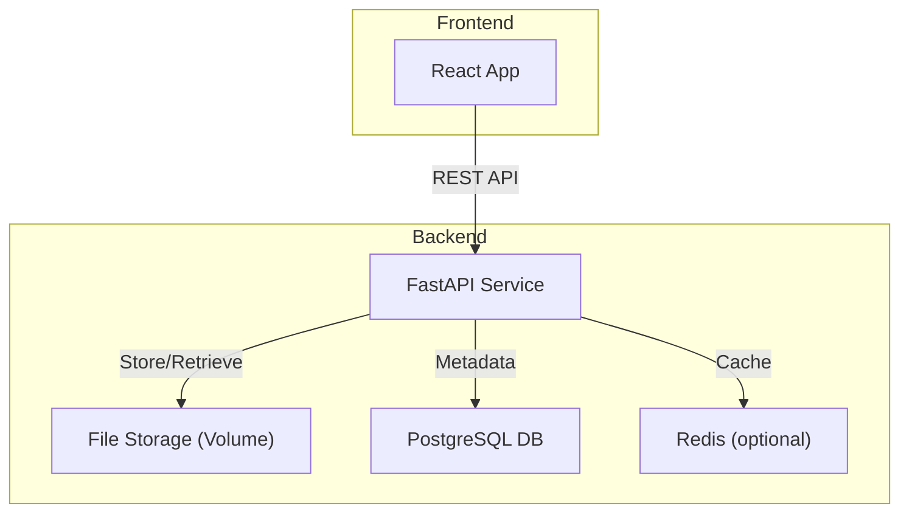

# Healthcare Document Management PoC – System Design

## 1. Tech Stack and Architecture Choice

**Frontend:**  
- **Framework:** React (with Vite for fast local dev)
- **Why:** Popular, fast, great ecosystem, easy file upload UI

**Backend:**  
- **Framework:** FastAPI (Python)
- **Why:** Modern, async, easy file upload handling, great OpenAPI docs

**Database:**  
- **Choice:** PostgreSQL (or SQLite for local dev)
- **Why:** Relational, supports multi-user, robust

**File Storage:**  
- **Choice:** Local disk (mounted Docker volume)
- **Why:** Simple for PoC, can swap for S3 in production

**Cache (Optional):**  
- **Choice:** Redis
- **Why:** Fast, easy to add for metadata/file caching

**Containerization:**  
- **Docker Compose** to orchestrate all services

### High-Level Architecture Diagram



### Key Components & Justification

- **React Frontend:** Modern, easy to use, good for file uploads
- **FastAPI Backend:** Async, type-safe, easy file handling
- **PostgreSQL:** Reliable, scalable, supports complex queries
- **Local File Storage:** Simple for PoC, can migrate to S3
- **Redis:** Optional, for performance
- **Docker Compose:** Easy local orchestration

---

## 2. Data Flow

**Upload:**
1. User uploads PDF via frontend.
2. Frontend sends `multipart/form-data` to backend.
3. Backend validates file, saves to disk, stores metadata in DB (with patient ID).
4. Backend returns success/failure to frontend.

**List:**
1. Frontend requests document list for a patient.
2. Backend queries DB, returns metadata (no file paths).

**Download:**
1. Frontend requests download for a file.
2. Backend checks auth, streams file (no real path exposed).

**Delete:**
1. Frontend requests delete for a file.
2. Backend deletes file from disk and metadata from DB.

**Metadata and Binary Handling:**
- **Metadata:** Stored in DB (filename, size, upload date, patient ID, storage key)
- **Binary:** Stored in mounted volume, referenced by storage key (not real path)

---

## 3. API Specification

### POST /documents/upload

- **Request:** `multipart/form-data`
  - `file`: PDF file
  - `patient_id`: string
- **Response:** JSON
  - `id`, `filename`, `size`, `upload_date`, `patient_id`

### GET /documents?patient_id=xxx

- **Request:** Query param: `patient_id`
- **Response:** JSON array of metadata

### GET /documents/:id/download

- **Request:** Path param: `id`
- **Response:** PDF file stream (with correct headers)

### DELETE /documents/:id

- **Request:** Path param: `id`
- **Response:** JSON `{ "success": true }`

---

## 4. Key Considerations

- **Scalability:**  
  - DB and storage can be scaled out; S3 can replace local storage for 100k+ files.
- **File Storage:**  
  - Files stored in Docker volume (local disk); can migrate to S3.
- **Error Handling:**  
  - 404 if file missing, 400 for invalid file, 500 for server errors.
- **Security:**  
  - JWT-based mock auth, only PDFs allowed, no real file paths exposed, CORS enabled.

---

## 5. CI/CD Pipeline Design

- **Build:** Lint, type-check, build frontend/backend Docker images
- **Test:** Run backend unit tests, (optional) frontend tests
- **Lint:** Enforce code style
- **Artifact Validation:** Ensure images build and run
- **Deploy:** (Not required for PoC, but can push to registry)

---

## 6. Infrastructure as Code (IaC) Snippets

### docker-compose.yml (snippet)

```yaml
version: "3.8"

services:
  backend:
    build: ./backend
    container_name: fastapi-backend
    ports:
      - "8000:8000"
    volumes:
      - ./backend/documents:/app/documents       
      - ./backend/test.db:/app/test.db 
    environment:
      - DATABASE_URL=sqlite:///./test.db
    restart: always

  frontend:
    build: ./frontend
    container_name: react-frontend
    ports:
      - "3000:3000"
    depends_on:
      - backend
    restart: always
```

### Dockerfile (backend, snippet)

```dockerfile
FROM python:3.11
WORKDIR /app
COPY requirements.txt .
RUN pip install --no-cache-dir -r requirements.txt
COPY . .
CMD ["uvicorn", "main:app", "--host", "0.0.0.0", "--port", "8000", "--reload"] 
```

### Dockerfile (frontend, snippet)

```dockerfile
FROM node:20
COPY package.json package-lock.json ./
RUN npm install
COPY . .
RUN npm install && npm run build

EXPOSE 3000
CMD ["serve", "-s", "build", "-l", "3000"]
```

---

## 7. Design Justification Questions

- **Why this file storage approach?**  
  - Local disk is simple for PoC, easy to swap for S3 in production.

- **HIPAA-compliance changes?**  
  - Use encrypted storage, audit logs, real auth, HTTPS, access controls, BAA with cloud providers.

- **Antivirus integration?**  
  - Add a scanning step (e.g., ClamAV) after upload, before saving file/metadata. 